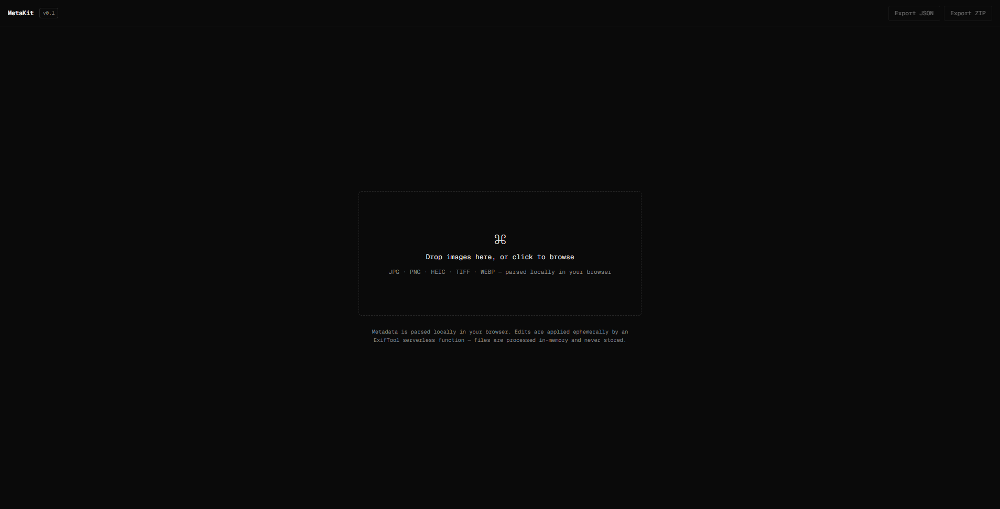

# MetaKit

Edit metadata in smartphone photos (Android & iPhone) — right in your browser.

[](https://metakit-six.vercel.app)



---

## What It Does

**MetaKit is built for smartphone photos** — JPEG and HEIC files from Android and iPhone cameras. View metadata from any photo format, edit JPEG and HEIC files (100% smartphone photo coverage).

### Core Features
- **View metadata** from any photo format (JPEG, HEIC, PNG, TIFF, RAW) — parsed locally in browser
- **Edit metadata** in JPEG and HEIC files: Title, Description, Creator, Copyright, Keywords, Camera info, ISO, Aperture, GPS, Date Taken
- **Auto-convert HEIC**: iPhone HEIC photos automatically convert to JPEG when edited (quality 95%)
- **Batch mode**: apply same edits to multiple photos at once (processes in chunks of 3 files)
- **Strip metadata**: remove GPS, camera serial, software info, edit history for privacy
- **Export ZIP**: download all edited files in one archive
- **Export JSON**: backup metadata without images
- **Revert**: restore original file after edits

### Privacy First
- Metadata parses locally in browser via [ExifReader](https://github.com/mattiasw/ExifReader)
- Files upload to server only when you click Save/Strip
- Processed in-memory, deleted immediately after response
- No database, no logs, no file retention, no user tracking

### Mobile Friendly
- Dark monospace theme (Geist Mono font)
- Responsive layout (collapsible sidebar on phones)
- Progress indicator for batch operations
- Selection counter with clear button

---

## Supported Formats

| Format | View Metadata | Edit Metadata | Strip Metadata | Use Case |
|--------|---------------|---------------|----------------|----------|
| **JPEG** | ✅ | ✅ | ✅ | Android photos, most shared photos |
| **HEIC** | ✅ | ✅ (converts to JPEG) | ✅ | iPhone native format (auto-converts when edited) |
| PNG, TIFF, RAW | ✅ | ❌ | ✅ | Professional cameras, screenshots |

### HEIC Handling

iPhone HEIC photos are **automatically converted to JPEG** when you edit metadata (quality 95%, ~5% loss). This is a technical limitation: HEIC uses a different metadata structure than JPEG, so we convert → edit → return JPEG.

**Trade-offs:**
- ✅ You can edit iPhone HEIC photos without manual conversion
- ✅ Output JPEG is more compatible than HEIC (works everywhere)
- ❌ Lossy conversion (~5% quality loss)
- ❌ File size increases (HEIC is typically 50% smaller than JPEG)
- ❌ Processing time +2-5 seconds per HEIC file
- ❌ You upload HEIC, download JPEG (format changes)

**Alternative:** If you need to preserve HEIC format, enable **Settings → Camera → Formats → Most Compatible** on iPhone to capture JPEG by default.

---

## Tech Stack

- Frontend: Next.js 16, React 19, TypeScript, Tailwind 4
- Metadata Read: [ExifReader](https://www.npmjs.com/package/exifreader) (client-side, all formats)
- Metadata Write: [piexifjs](https://www.npmjs.com/package/piexifjs) (server-side, JPEG only)
- HEIC Conversion: [sharp](https://www.npmjs.com/package/sharp) (server-side, HEIC→JPEG)
- Export: JSZip
- Deploy: Vercel (serverless, no Perl/ExifTool dependency)

---

## Usage

### Upload & View
1. Visit [metakit-six.vercel.app](https://metakit-six.vercel.app)
2. Drag-drop or click to upload photos
3. Files parse locally (no upload yet)
4. Click a file, switch to **Viewer** tab to see metadata

### Edit Single Photo
1. Select a JPEG or HEIC file (badge shows "View only" for PNG/TIFF)
2. Switch to **Editor** tab
3. Fill fields: Title, Description, Keywords, Camera info, GPS, Date Taken
4. Click **Save edits** → file auto-downloads with updated metadata (HEIC converts to JPEG)

### Batch Edit
1. Toggle **Batch mode** (top-right checkbox)
2. Check JPEG/HEIC files to edit (PNG/TIFF files are skipped)
3. Fill fields (same values apply to all checked files)
4. Click **Apply to N file(s)** → server processes in chunks (3 files/request)
5. Progress shows "Processing 1-3 of 10..."
6. Click **Export ZIP** to download all edited files

### Strip Metadata (Privacy)
1. Select file(s) — works on any format
2. Click **Strip all**, confirm
3. Metadata removed: EXIF, GPS, camera serial, software info, edit history
4. Single file auto-downloads; batch files need **Export ZIP**

### Revert to Original
- After editing, **Revert** button appears (single-file mode)
- Click to restore original unedited file

---

## Editable Fields (18 for JPEG)

### Descriptive
Title, Description, Creator/Artist, Copyright, Keywords, User Comment

### Camera & Technical
Camera Make, Camera Model, Lens Model, ISO, Aperture (F-number), Shutter Speed, Focal Length, White Balance, Flash

### Location & Time
Date Taken, GPS Latitude, GPS Longitude

---

## Limits (Vercel Hobby Plan)

| Scenario | Limit | Notes |
|----------|-------|-------|
| Single file size | 4.5MB upload | Files >4MB use chunked upload (up to 20MB supported) |
| Batch size | ~50-100 photos | Chunked processing (3 files/request) |
| Function timeout | 60s | ~20-30 files per batch max |
| Viewer | ~100-200 photos | Browser memory limit (~1GB) |

---

## Privacy & Security

**Client-side parsing:** ExifReader runs in browser, no upload until you click Save/Strip.

**Server processing:** Files upload to Vercel serverless function only during Save/Strip actions. Processed in-memory, deleted immediately after response.

**No retention:** No database, no logs, no file storage, no user tracking.

**Open source:** Repo is public at [github.com/gievano/metakit](https://github.com/gievano/metakit).

---

## Development

### Local Setup
```bash
git clone https://github.com/gievano/metakit.git
cd metakit
npm install
npm run dev
```

Open [http://localhost:3000](http://localhost:3000)

### Build
```bash
npm run build
```

### Deploy
Push to `main` branch, auto-deploys to Vercel

---

## Use Cases

### Photography
- Add copyright, photographer name, keywords before client delivery
- Batch apply event name and date to 50+ wedding photos
- Fix GPS coordinates (wrong location or missing data)
- Strip metadata before social media upload

### Privacy
- Remove GPS location before sharing online
- Anonymize photos: remove camera serial, software info, edit history
- Clean metadata before submitting to public contests/portfolios

### Archival
- Export JSON metadata catalog (backup without images)
- Standardize camera/lens info across collection (batch edit Make/Model)
- Add missing Date Taken to scanned old photos

---

## Known Issues

- Large files (RAW above 4MB): viewable but not editable (server upload limit)
- HEIC preview: Chrome/Firefox can't preview HEIC thumbnails (Safari can), but metadata is readable/editable
- Batch above 50 files: may timeout on Vercel Hobby (60s limit); split into smaller batches

---

## Roadmap

- [ ] Import metadata from JSON (restore from backup)
- [ ] Advanced mode: edit any EXIF tag (freeform tag input)
- [ ] Keywords tag pills UI (autocomplete, multi-select)
- [ ] Metadata diff viewer (before/after comparison)
- [ ] Batch revert (restore original for multiple files)
- [ ] S3/R2 upload for large file support (bypass 4.5MB limit)

---

## License

MIT

---

## Author

Built by [@gievano](https://github.com/gievano)

Live at [metakit-six.vercel.app](https://metakit-six.vercel.app)
